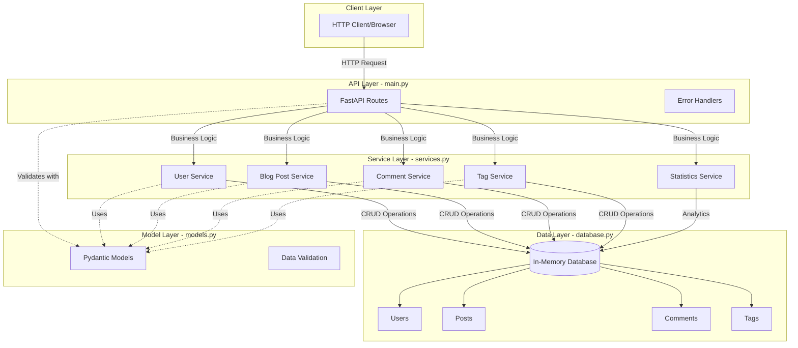
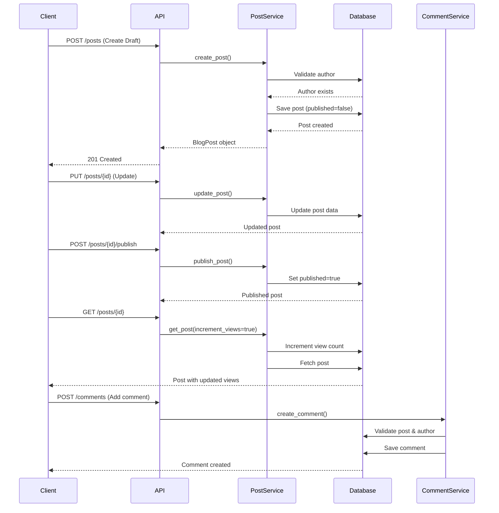
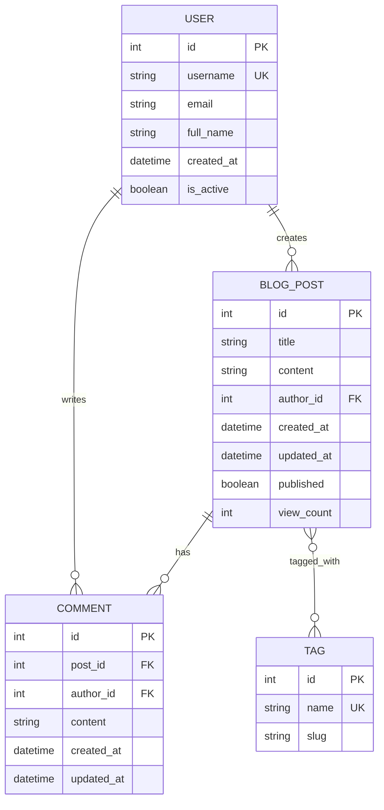

# Blog API - FastAPI Example

A comprehensive blog API built with FastAPI demonstrating complex multi-file architecture, RESTful design, and business logic separation.

## 🏗️ Architecture

This project demonstrates a well-structured FastAPI application with clear separation of concerns:

- **models.py**: Pydantic data models and schemas
- **database.py**: In-memory database with thread-safe operations
- **services.py**: Business logic layer
- **main.py**: FastAPI application with REST endpoints

## 📊 System Architecture Diagram



## 🔄 Blog Post Lifecycle Flow



## 🗄️ Data Model Relationships



## 🚀 Quick Start

### Installation

```bash
# Install dependencies
pip install -r requirements.txt
```

### Running the API

```bash
# Run the development server
python -m uvicorn blog_api.main:app --reload

# Or run directly
python -m blog_api.main
```

The API will be available at:
- API Base: http://localhost:8000
- Interactive Docs: http://localhost:8000/docs
- Alternative Docs: http://localhost:8000/redoc

## 📚 API Endpoints

### Users
- `POST /users` - Create a new user
- `GET /users` - Get all users
- `GET /users/{user_id}` - Get a specific user
- `GET /users/{user_id}/posts` - Get all posts by a user

### Blog Posts
- `POST /posts` - Create a new blog post
- `GET /posts` - Get all posts (with optional `published_only` filter)
- `GET /posts/{post_id}` - Get a specific post
- `PUT /posts/{post_id}` - Update a post
- `DELETE /posts/{post_id}` - Delete a post
- `POST /posts/{post_id}/publish` - Publish a post
- `POST /posts/{post_id}/unpublish` - Unpublish a post

### Comments
- `POST /comments` - Create a new comment
- `GET /comments/{comment_id}` - Get a specific comment
- `GET /posts/{post_id}/comments` - Get all comments for a post
- `DELETE /comments/{comment_id}` - Delete a comment

### Tags
- `POST /tags` - Create a new tag
- `GET /tags` - Get all tags
- `GET /tags/{tag_id}` - Get a specific tag
- `GET /tags/{tag_id}/posts` - Get all posts with a tag

### Search
- `GET /search?q=query` - Search posts by title or content

### Statistics
- `GET /statistics` - Get overall blog statistics
- `GET /statistics/most-viewed` - Get most viewed posts
- `GET /statistics/most-commented` - Get most commented posts

## 🧪 Example Usage

### Create a User
```bash
curl -X POST http://localhost:8000/users \
  -H "Content-Type: application/json" \
  -d '{
    "username": "johndoe",
    "email": "john@example.com",
    "full_name": "John Doe"
  }'
```

### Create a Blog Post
```bash
curl -X POST http://localhost:8000/posts \
  -H "Content-Type: application/json" \
  -d '{
    "title": "My First Blog Post",
    "content": "This is the content of my first post...",
    "author_id": 1,
    "published": true,
    "tags": [1, 2]
  }'
```

### Add a Comment
```bash
curl -X POST http://localhost:8000/comments \
  -H "Content-Type: application/json" \
  -d '{
    "post_id": 1,
    "author_id": 2,
    "content": "Great post! Very informative."
  }'
```

### Search Posts
```bash
curl http://localhost:8000/search?q=fastapi
```

## 🔧 Key Features

- **RESTful API Design**: Clean, intuitive endpoints following REST principles
- **Data Validation**: Pydantic models ensure data integrity
- **Business Logic Separation**: Clear separation between API, service, and data layers
- **Thread-Safe Operations**: In-memory database with proper locking
- **Comprehensive Error Handling**: Detailed error messages and proper HTTP status codes
- **Interactive Documentation**: Auto-generated OpenAPI/Swagger docs
- **Search Functionality**: Full-text search across blog posts
- **Statistics & Analytics**: Built-in analytics for tracking engagement
- **Tag System**: Flexible tagging system for content organization

## 📁 Project Structure

```
blog_api/
├── __init__.py          # Package initialization
├── main.py              # FastAPI application and routes
├── models.py            # Pydantic data models
├── database.py          # In-memory database operations
└── services.py          # Business logic layer
```

## 🎯 Use Cases

This example is perfect for:
- **Code Review Practice**: Complex enough to demonstrate various code review scenarios
- **Learning FastAPI**: Demonstrates best practices and patterns
- **Microservice Template**: Can be adapted as a template for real services
- **API Design Examples**: Shows RESTful design patterns
- **Testing Scenarios**: Good foundation for writing tests

## 🔍 Code Review Focus Areas

When reviewing this code, consider:

1. **Architecture**: Is the separation of concerns clear?
2. **Data Flow**: How does data flow through the layers?
3. **Error Handling**: Are errors handled appropriately?
4. **Validation**: Is input validation comprehensive?
5. **Thread Safety**: Are concurrent operations handled safely?
6. **API Design**: Do endpoints follow REST principles?
7. **Documentation**: Is the code well-documented?
8. **Scalability**: Could this scale to a real database?

## 📝 Notes

- This uses an in-memory database for simplicity
- No authentication/authorization (would be added in production)
- Thread-safe but single-process (use Redis/PostgreSQL for multi-process)
- Sample data is pre-populated on startup

## 📄 License

This is a demonstration project for educational purposes.
